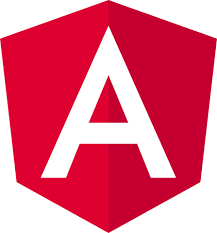

### Hi there, I'm Tarun 👋

## I'm a Full-Stack Developer!
> Hi I'm Tarun. An experienced Full Stack Developer with 5 Years of Experience. I'm passionate about coding and learning new languages. I've comprehensive knowledge of platform development, enterprise architecture, agile methodologies, cloud services, and web-based applications. I would say that I'm an innovative change agent with a unique mix of high-level technology direction with deep technical expertise.

- 🔭 I’m currently working on a **Chat App**
- 🌱 I’m currently learning React and React Native 🤣
- 🥅 2020 Goals: Contribute more to Open Source projects
- ⚡ Fun fact: I love to work on UI/UX

### Connect with me:

[][linkedin]
[][instagram]
[][twitter]
[][codepen]
[][stackoverflow]
[][github]

 

### Languages and Tools:

#### 📜 Backend

 
 

#### 💻 Frontend

 
 

#### 💽 Databases

 
 

#### 📱 Mobile Apps

 
 

#### 🌐 Cloud

 
 

#### 🩹 Testing

 
 

#### 🎛 Cuz it's mentioned in JD

---

[linkedin]: https://www.linkedin.com/in/tarun12/
[twitter]: https://twitter.com/beingMe_Tarun
[github]: https://github.com/devtarun
[instagram]: https://www.instagram.com/beingme_tarun/
[codepen]: https://codepen.io/devtarun
[stackoverflow]: https://stackoverflow.com/users/6748760/tarun
